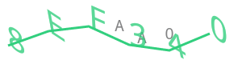

# Captcha

Create captcha by using canvas module.

```deno
import { createCaptcha } from "https://deno.land/x/captcha/mods.ts";

const captcha = createCaptcha();

console.log(captcha.text);

await Deno.writeFile('captcha.png', captcha.image);
```

